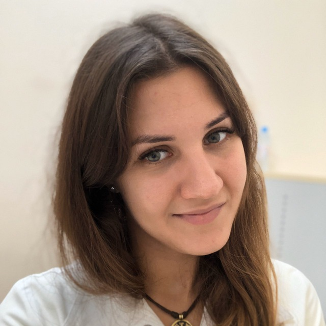

# Обо мне

Меня зовут **Анастасия**, мне 31 год, я **врач ультразвуковой диагностики**, живу в Калининграде. Считаю себя профессионалом своего дела и получаю искреннее удовольствие, помогая людям. 

Работа для меня – это не просто профессия, это возможность делать мир лучше, приносить реальную пользу. Стараюсь подходить к своей работе ответственно,  вкладывая в нее  все свои знания и опыт. Если вы хотели провести диагностику своего организма, то можете воспользоваться услугами нашей [клиники](https://estelia39.ru/ "Сайт Эстелии").

В общении я дружелюбна и отзывчива, всегда готова поддержать и помочь, если это в моих силах.  Обладаю хорошим чувством юмора,  легко нахожу общий язык с людьми. 

Помимо медицины, в моей жизни есть место для творчества и путешествий:

- люблю петь
- играть на гитаре 
- с удовольствием  участвую в  интересных  креативных проектах.  
 
Стараюсь развиваться  в разных направлениях,  пробовать себя  в новых сферах,  постоянно  учиться  и  совершенствоваться. 

Думаю, меня можно описать как  яркую, разностороннюю личность  с  активной  жизненной позицией  и  большим  желанием  делать  мир  вокруг себя  чуточку  лучше.